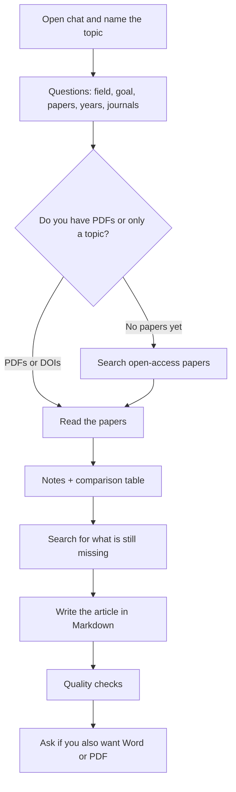

# Life-science literature review helper

A **free, non-commercial** tool: talk to an assistant (Cursor, ChatGPT, or Claude) and get a literature review in Markdown — one note per paper, a comparison table, and a journal-style article.

You do not need to know how to code. You do not need to train a model. You need a chat subscription you already use, and this repository.

**License:** you may use, copy, and adapt this for a thesis, papers, and teaching. **You may not sell it** or turn the workflow into a paid product or service. See [LICENSE](LICENSE).

---

## What it does (one sentence)

Tell the assistant your topic (or drop PDFs). It asks who you are and what you need. Then it reads open-access papers, extracts facts, builds a table, and writes an `.md` article whose introduction teaches the field — not a list of abstracts.

## What you need

Any one of these accounts is enough:

| Tool | What to do |
|---|---|
| **[Cursor](https://cursor.com)** (recommended) | Open this folder. `AGENTS.md` tells the assistant what to do. |
| **ChatGPT** (Plus / Team / Edu) | Create a Project, upload `AGENTS.md` and the `.cursor/skills/` folder, and type: “Follow AGENTS.md. I want a literature review.” |
| **Claude** (Pro / Team) | Same: a Project with those files, and the same request. |

You do not need an OpenAlex or Unpaywall API key. If the assistant searches the web for papers, it asks for a **contact email** (those services request it), not a credit card.

## Tutorial in 6 steps (Cursor)

1. Open [this repository on GitHub](https://github.com/hvianagil-alt/literature-ai-workflow). Click **Code → Open with Cursor**, or download the ZIP and open the folder in Cursor (**File → Open Folder**).
2. Open **chat** (you do not need to open any code).
3. Type, for example: `Review my papers` or `I want a literature review on [topic]`.
4. The assistant **asks first** (it does not start the article immediately):
   - your research area (e.g. nanomedicine, endocrinology, microbiology)
   - what the review is for (thesis, grant, paper introduction, reading)
   - whether you **already have papers** (PDFs in `papers/`, or titles/DOIs in the chat)
   - if **not**, whether it should **search the web** for open-access papers only
   - filters: **years** (e.g. last 6 years) and **journal quality** (peer-reviewed journals, etc.)
   - whether you also want Word or PDF later (the main file is always **Markdown**)
5. Confirm (“yes, that is right”) before the deep work.
6. Receive, in the `review/` folder:
   - `article.md` — the article (this is the file that matters)
   - a table and notes next to it
   - a `double-check.md` showing that numbers were checked

If you have no PDFs, do not stop. Name the topic. It searches **free public** papers. It does not use pirate sites or paywalls.

### Without Cursor (ChatGPT or Claude only)

1. On GitHub, click **Code → Download ZIP**.
2. In ChatGPT or Claude, create a Project and upload at least `AGENTS.md` and the files under `.cursor/skills/`.
3. If you have PDFs, upload them too (or paste titles and DOIs).
4. Type: `Follow AGENTS.md. I work in [field]. I want [kind of review].`
5. Answer the questions. Ask for the article in Markdown and save the text as a `.md` file.

Phone chat gives you the text; Cursor gives you files already organized in the folder.

## The workflow (map)



## How the text is formatted

The article is always **Markdown** (`.md`): you can open it in Cursor, VS Code, GitHub, or paste it into Word.

If you ask for Word or PDF, the assistant uses `export-manuscript`: body in **Times New Roman**, **12 pt**, **justified**. You can also open the HTML in a browser and use Print → Save as PDF.

## See quality before you run it (real examples in this repo)

These are test outputs in the life sciences — to judge tone and level, not to cite as your own work:

| What it is | File |
|---|---|
| Nanocarriers / liposomes / AgNPs (2026) | [`review/runs/2026-09-19-nanocarriers/article.md`](review/runs/2026-09-19-nanocarriers/article.md) |
| Comparison table for that review | [`review/runs/2026-09-19-nanocarriers/table/literature-table.md`](review/runs/2026-09-19-nanocarriers/table/literature-table.md) |
| Second look (numbers checked) | [`review/runs/2026-09-19-nanocarriers/double-check.md`](review/runs/2026-09-19-nanocarriers/double-check.md) |
| **Fictional** form example (not real research) | [`examples/sample-article.md`](examples/sample-article.md) |

More context: [`showcase/README.md`](showcase/README.md).

Original paper **PDFs are not in git** (copyright). Only the review manuscript is.

## What it does not do

- Invent citations.
- Unlock paywalled papers.
- Replace your scientific judgment. It is a strong draft for you to edit.
- Act as a commercial product. See [LICENSE](LICENSE).

---

Clone or open [this GitHub repo](https://github.com/hvianagil-alt/literature-ai-workflow) in **Cursor**, or load `AGENTS.md` into a ChatGPT / Claude project. Type “Review my papers.” The assistant asks your field, the job (thesis, grant, paper), whether you have PDFs or it should fetch **open-access** papers, and filters (years, journal quality). Default output is **Markdown**. Word/PDF (Times New Roman, justified) is optional.

```bash
git clone https://github.com/hvianagil-alt/literature-ai-workflow.git
cd literature-ai-workflow
```

Drop PDFs in `papers/` or start from a topic. After you confirm scope, the assistant writes notes, a comparison table, a teaching Introduction, numbered thematic sections, **Table 1** callouts, and a double-check log. Abbreviations look like `type 2 diabetes (T2D)`, then `T2D`.

## How it works (for the curious)

Cursor supports **skills**: small instruction files that tell the AI exactly how to do a specific job. This repo has thirteen:

| Skill | What it does |
|---|---|
| [`paper-extraction`](.cursor/skills/paper-extraction/SKILL.md) | Reads one paper, produces one structured note |
| [`literature-table`](.cursor/skills/literature-table/SKILL.md) | Turns notes into a comparable table |
| [`synthesis-rationale`](.cursor/skills/synthesis-rationale/SKILL.md) | Interprets the set, lists gaps, attempts extra OA retrieval |
| [`report-writing`](.cursor/skills/report-writing/SKILL.md) | Writes the review from that rationale |
| [`review-prose`](.cursor/skills/review-prose/SKILL.md) | Teaching Introduction, claim-first sentences, in-article tables |
| [`article-qa`](.cursor/skills/article-qa/SKILL.md) | Runs the extraction and article checks |
| [`double-check`](.cursor/skills/double-check/SKILL.md) | Second look: numbers, Abstract, story spine |
| [`find-papers`](.cursor/skills/find-papers/SKILL.md) | Search free OA papers if you dropped none (or only seeds) |
| [`related-paper-exploration`](.cursor/skills/related-paper-exploration/SKILL.md) | Gap-driven OA retrieval; never invents citations |
| [`bib-import`](.cursor/skills/bib-import/SKILL.md) | Parses a Scopus/BibTeX export |
| [`oa-fetch`](.cursor/skills/oa-fetch/SKILL.md) | Retrieves public open-access PDFs |
| [`prisma-logging`](.cursor/skills/prisma-logging/SKILL.md) | PRISMA counts and usage logs |
| [`export-manuscript`](.cursor/skills/export-manuscript/SKILL.md) | Optional Word/PDF/HTML, Times New Roman, justified |

[`AGENTS.md`](AGENTS.md) is what the assistant follows. [`.cursor/agents/literature-review.md`](.cursor/agents/literature-review.md) makes “review my papers” start this workflow.

Finding papers uses **OpenAlex** (free). A **contact email** may be asked once. No pirate sites.

## Repeatable by design

After you confirm scope, the agent should extract claim-ready notes, build the comparison table, write a synthesis rationale (and try public open-access extra papers for gaps), write a journal article whose Introduction teaches the field and whose body is numbered thematic sections (not a Results dump), with numbered results tables that the prose points to, and pass `scripts/check_extraction.py` plus `scripts/check_article.py`, then a double-check log that includes an adjacent-field reader test. PDFs stay gitignored. If a check fails, the article is not done.

## License

[Non-commercial / CC BY-NC-SA 4.0-style](LICENSE) — use freely for research and teaching; do not sell.
