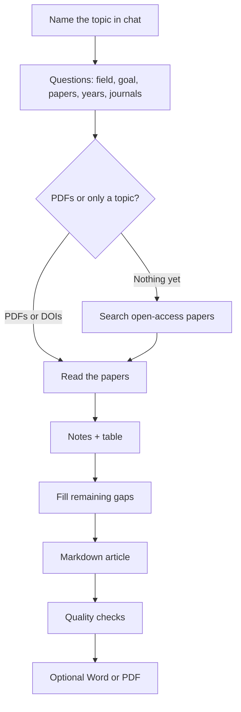

# Life-science literature review helper

Talk to **Cursor**, **ChatGPT**, or **Claude** and get a literature review: notes on each paper, a comparison table, and a journal-style article in Markdown.

You do not need to code. You need a chat account you already have, and this repository.

**License (non-commercial):** use it for a thesis, papers, and teaching. Do not sell it or turn it into a paid service. See [LICENSE](LICENSE).

## What it does

You name a topic or drop PDFs. The assistant asks who you are and what you need, then reads **open-access** papers, extracts facts, builds a table, and writes an `.md` article. The introduction is meant to teach the field, not dump abstracts.

It does not invent citations, open paywalls, or replace your scientific judgment. The article is a strong draft for you to edit.

## Does it work?

Open this sample (life sciences, real papers):

| File | What it is |
|---|---|
| [article.md](review/runs/2026-09-19-nanocarriers/article.md) | Full review (nanocarriers / liposomes / AgNPs) |
| [literature-table.md](review/runs/2026-09-19-nanocarriers/table/literature-table.md) | Side-by-side comparison |
| [double-check.md](review/runs/2026-09-19-nanocarriers/double-check.md) | Log that numbers were checked against the papers |
| [fictional example](examples/sample-article.md) | Form only — invented papers, not real science |

Source PDFs are not in git (copyright). More pointers: [showcase/README.md](showcase/README.md).

## What you need

| Tool | What to do |
|---|---|
| **[Cursor](https://cursor.com)** (recommended) | Open this folder. Chat is enough; you do not open code. |
| **ChatGPT** (Plus / Team / Edu) | New Project → upload `AGENTS.md` and `.cursor/skills/` → “Follow AGENTS.md. I want a literature review.” |
| **Claude** (Pro / Team) | Same as ChatGPT. |

If it searches the web for papers, it may ask for a **contact email** (OpenAlex / Unpaywall). That is not a paid API key.

## How to run it (Cursor)

1. Open [this repo](https://github.com/hvianagil-alt/literature-ai-workflow): **Code → Open with Cursor**, or unzip and **File → Open Folder**.
2. Open **chat**. Type `Review my papers` or `I want a literature review on [topic]`.
3. It **asks first** (it should not write the article immediately):
   - your research area
   - what the review is for (thesis, grant, paper introduction, reading)
   - whether you already have papers (PDFs in `papers/`, or titles/DOIs in the chat)
   - if not, whether it should search **free open-access** papers (no pirate sites)
   - **years** and **journal quality** (e.g. last 6 years, peer-reviewed journals)
   - whether you also want Word or PDF later (the main file is always Markdown)
4. Confirm the plan.
5. When it is done, open `review/`:
   - `article.md` — the article
   - a table and per-paper notes
   - `double-check.md`

No PDFs is fine: name the topic and it will search public papers.

### ChatGPT or Claude only

Download the ZIP from GitHub (**Code → Download ZIP**). In a Project, upload `AGENTS.md`, the `.cursor/skills/` files, and any PDFs. Type: `Follow AGENTS.md. I work in [field]. I want a literature review.` Save the Markdown it returns as `article.md`. Cursor keeps files in folders for you; phone chat only gives you the text.

## Workflow



## Files you receive

The article is **Markdown** (`.md`): open it here or paste into Word.

Ask for Word or PDF if you want **Times New Roman**, 12 pt, **justified** (`export-manuscript`). You can also open the HTML in a browser and Print → Save as PDF.

```bash
git clone https://github.com/hvianagil-alt/literature-ai-workflow.git
cd literature-ai-workflow
```
