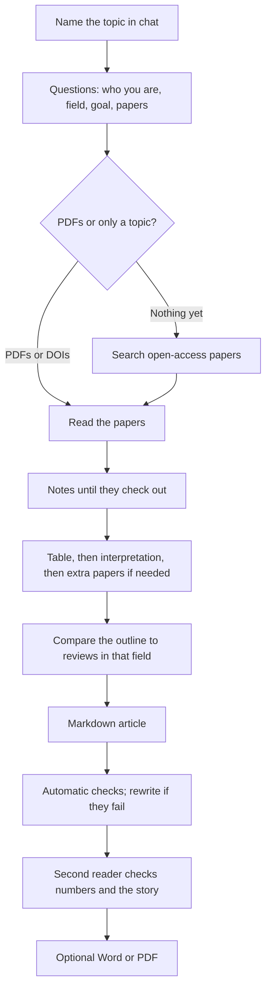

# Life-science literature review helper

Talk to **Cursor**, **ChatGPT**, or **Claude** and get a literature review: notes on each paper, a comparison table, and a journal-style article in Markdown.

You do not need to code. You need a chat account you already have, and this repository.

**License (Non-commercial):** use it for a thesis, papers, and teaching. Do not sell it or turn it into a paid service. See [LICENSE](LICENSE).

## What it does

You name a topic or drop PDFs. The assistant asks who you are and what you need, then reads **open-access** papers, extracts facts, builds a table, checks the notes, writes an `.md` article, and checks the story again. The introduction is meant to teach the field, not dump abstracts. It works for a new user in different life-science fields (food, endocrinology, nanomedicine, or another topic you name).

It does not invent citations, open paywalls, or replace your scientific judgment. The article is a strong draft for you to edit.

## Does it work?

Open these samples (life sciences, real open-access papers). Each run folder has `article.md`, a table, notes, and usually `double-check.md`. Source PDFs are not in git (copyright). More detail: [showcase/README.md](showcase/README.md).

| Field | Topic | How it started | Article | Table | Double-check |
|---|---|---|---|---|---|
| Nanomedicine | Liposomes, AgNPs, nasal mucosa | Seed PDFs + related OpenAlex search | [article](review/runs/2026-09-19-nanocarriers/article.md) | [table](review/runs/2026-09-19-nanocarriers/table/literature-table.md) | [log](review/runs/2026-09-19-nanocarriers/double-check.md) |
| Endocrinology / nanomedicine | Ocular drug delivery for diabetic retinopathy (27 papers) | **Topic only** — empty `papers/` | [article](review/runs/2026-09-20-dr-drug-delivery/article.md) | [table](review/runs/2026-09-20-dr-drug-delivery/table/literature-table.md) | [log](review/runs/2026-09-20-dr-drug-delivery/double-check.md) |
| Endocrinology | GLP-1 receptor agonists, delivery, metabolic disease (44 papers) | Scopus `.bib` export | [article](review/runs/2026-09-19-scopus-oa-full/article.md) | [table](review/runs/2026-09-19-scopus-oa-full/table/literature-table.md) | [log](review/runs/2026-09-19-scopus-oa-full/double-check.md) |
| Food science | High-pressure processing of foods (43 papers) | Scopus `.bib` export | [article](review/runs/2026-09-20-hpp-rerun/article.md) | [table](review/runs/2026-09-20-hpp-rerun/table/literature-table.md) | [log](review/runs/2026-09-20-hpp-rerun/double-check.md) |
| Neuroscience | Parkinson’s disease and cannabinoids (31 papers) | Scopus `.bib` export | [article](review/runs/2026-09-20-pd-cannabinoids/article.md) | [table](review/runs/2026-09-20-pd-cannabinoids/table/literature-table.md) | [log](review/runs/2026-09-20-pd-cannabinoids/double-check.md) |
| — | Form only (invented papers — **do not cite**) | Worked example | [sample](examples/sample-article.md) | — | — |

**Three ways to start:** drop PDFs in `papers/`, upload a Scopus/PubMed `.bib` export, or name a topic with an empty folder (OpenAlex search, public PDFs only). The DR run is the topic-only example; GLP-1, HPP, and PD runs show the Scopus path.

## What you need

| Tool | What to do |
|---|---|
| **[Cursor](https://cursor.com)** (recommended) | Open this folder. Chat is enough; you do not open code. |
| **ChatGPT** (Plus / Team / Edu) | New Project → upload `AGENTS.md` and `.cursor/skills/` → “Follow AGENTS.md. I want a literature review.” |
| **Claude** (Pro / Team) | Same as ChatGPT. |

If it searches the web for papers, it may ask for a **contact email** (OpenAlex / Unpaywall). That is not a paid API key.

## How to run it (Cursor)

1. Open [this repo](https://github.com/hvianagil-alt/literature-ai-workflow): **Code → Open with Cursor**, or unzip and **File → Open Folder**.
2. Open **chat**. Type `Review my papers` or `I want a literature review on [topic]`.
3. It **starts with a conversation** (it should not write the article immediately). Treat yourself as welcome even if this is your first time:
   - it says what it will do (read papers, make a table, write a Markdown article — no invented citations)
   - it tells you what is already in `papers/`
   - it asks who you are, your field, what the review is for, and what you already have
   - **years** and **journal quality** (e.g. last 6 years, peer-reviewed journals)
   - whether you also want Word or PDF later (the main file is always Markdown)
4. Confirm the plan.
5. When it is done, open `review/`:
   - `article.md` — the article
   - a table and per-paper notes
   - `double-check.md`

No PDFs is fine: name the topic and it will search public papers (see the DR sample above).

### ChatGPT or Claude only

Download the ZIP from GitHub (**Code → Download ZIP**). In a Project, upload `AGENTS.md`, the `.cursor/skills/` files, and any PDFs. Type: `Follow AGENTS.md. I work in [field]. I want a literature review.` Save the Markdown it returns as `article.md`. Cursor keeps files in folders for you; phone chat only gives you the text.

## Workflow



## Files you receive

The article is **Markdown** (`.md`): open it here or paste into Word.

Ask for Word or PDF if you want **Times New Roman**, 12 pt, **justified** (`export-manuscript`). You can also open the HTML in a browser and Print → Save as PDF.

```bash
python3 scripts/export_manuscript.py \
  --article review/runs/<run-id>/article.md \
  --out-dir review/runs/<run-id>/export \
  --format html,pdf
```

(`pdf` needs WeasyPrint: `pip install weasyprint`. `docx` needs Pandoc.)

```bash
git clone https://github.com/hvianagil-alt/literature-ai-workflow.git
cd literature-ai-workflow
```
