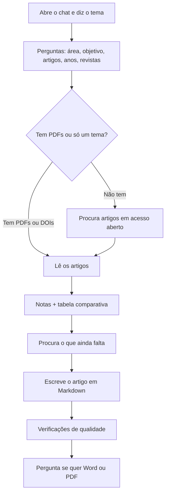

# Revisão de literatura para ciências da vida

Ferramenta **grátis para investigação sem fins comerciais**: conversa com um assistente (Cursor, ChatGPT ou Claude) e recebe uma revisão de literatura em Markdown — notas por artigo, uma tabela comparativa, e um artigo científico.

Não precisa de saber programar. Não precisa de treinar um modelo. Precisa só de uma subscrição do chat que já usa, e de abrir este repositório.

**Licença:** pode usar, copiar e adaptar para tese, papers e ensino. **Não pode vender isto** nem transformar o fluxo num serviço ou produto que ganhe dinheiro. Ver [LICENSE](LICENSE).

---

## O que isto faz (em uma frase)

Diz ao assistente o seu tema (ou larga PDFs). Ele pergunta quem é e o que precisa. Depois lê artigos em acesso aberto, extrai factos, monta uma tabela, e escreve um artigo em `.md` — com introdução que ensina o campo, não uma lista de resumos.

## De que precisa

Qualquer uma destas contas chega:

| Ferramenta | O que fazer |
|---|---|
| **[Cursor](https://cursor.com)** (recomendado) | Abrir esta pasta. O ficheiro `AGENTS.md` diz ao assistente o que fazer, sozinho. |
| **ChatGPT** (Plus / Team / Edu) | Criar um *Project*, carregar `AGENTS.md` e a pasta `.cursor/skills/`, e escrever: “Segue AGENTS.md. Quero uma revisão de literatura.” |
| **Claude** (Pro / Team) | O mesmo: *Project* com esses ficheiros, e o mesmo pedido. |

Não precisa de chave da OpenAlex nem de Unpaywall. Se o assistente for à internet buscar artigos, pede-lhe **um email de contacto** (regra de boa educação desses serviços), não um cartão de crédito.

## Tutorial em 6 passos (Cursor)

1. Abra [este repositório no GitHub](https://github.com/hvianagil-alt/literature-ai-workflow). Clique **Code → Open with Cursor**, ou descarregue o ZIP e abra a pasta no Cursor (**File → Open Folder**).
2. Abra o **chat** (não precisa de abrir código).
3. Escreva, em português ou inglês, por exemplo: `Quero uma revisão de literatura` ou `Review my papers`.
4. O assistente **pergunta primeiro** (não começa a escrever o artigo):
   - em que área trabalha (ex.: nanomedicina, endocrinologia, microbiologia)
   - para que quer a revisão (tese, grant, introdução de paper, leitura)
   - se **já tem artigos** (PDFs na pasta `papers/`, ou títulos/DOIs no chat)
   - se **não tem**, se quer que ele **busque na internet** só artigos em acesso aberto
   - filtros: **anos** (ex.: últimos 6 anos) e **qualidade da revista** (só journals com revisão por pares, etc.)
   - se no fim quer também Word ou PDF (o ficheiro principal é sempre **Markdown**)
5. Confirme (“sim, está certo”) antes do trabalho fundo.
6. Receba, na pasta `review/`:
   - `article.md` — o artigo (este é o ficheiro que importa)
   - tabela e notas ao lado
   - um `double-check.md` a dizer que os números foram conferidos

Se não tiver PDFs, não pare. Diga o tema. Ele procura artigos **gratuitos e públicos**. Não entra em sites pirata nem em paywalls.

### Sem Cursor (só ChatGPT ou Claude)

1. No GitHub, clique **Code → Download ZIP**.
2. No ChatGPT ou Claude, crie um Project e carregue pelo menos `AGENTS.md` e os ficheiros dentro de `.cursor/skills/`.
3. Se tiver PDFs, carregue-os também (ou cole títulos e DOIs).
4. Escreva: `Segue AGENTS.md. Trabalho em [área]. Quero [tipo de revisão].`
5. Responda às perguntas. Peça o artigo em Markdown no chat e grave o texto num ficheiro `.md`.

Quem só usa o chat no telemóvel consegue o texto; quem usa Cursor consegue os ficheiros já organizados na pasta.

## O fluxo (mapa)



## Como fica o texto

O artigo sai sempre em **Markdown** (`.md`): dá para abrir no Cursor, no VS Code, no GitHub, ou colar no Word.

Se pedir Word ou PDF, o assistente usa o passo `export-manuscript`: corpo em **Times New Roman**, **12 pt**, **texto justificado**. Pode também abrir o HTML no browser e fazer Imprimir → Guardar como PDF.

## Ver qualidade antes de usar (exemplos reais neste repo)

Estes são resultados de testes com artigos de ciências da vida — para ver o tom e o nível, não para citar como se fossem o seu trabalho:

| O que é | Ficheiro |
|---|---|
| Revisão de nanocarreadores / lipossomas / AgNP (2026) | [`review/runs/2026-09-19-nanocarriers/article.md`](review/runs/2026-09-19-nanocarriers/article.md) |
| Tabela dessa revisão | [`review/runs/2026-09-19-nanocarriers/table/literature-table.md`](review/runs/2026-09-19-nanocarriers/table/literature-table.md) |
| Segunda leitura (números conferidos) | [`review/runs/2026-09-19-nanocarriers/double-check.md`](review/runs/2026-09-19-nanocarriers/double-check.md) |
| Exemplo **inventado** (não é investigação real) | [`examples/sample-article.md`](examples/sample-article.md) |

Mais contexto: [`showcase/README.md`](showcase/README.md).

Os PDFs originais **não** vão para o Git (direitos de autor). Só o manuscrito da revisão.

## O que **não** faz

- Não inventa citações.
- Não desbloqueia artigos pagos.
- Não substitui o seu julgamento científico. É um rascunho forte para si editar.
- Não é um produto comercial. Ver [LICENSE](LICENSE).

---

## English (short)

**Life-science literature review helper.** Free for non-profit research. Not for resale.

Clone or open [this GitHub repo](https://github.com/hvianagil-alt/literature-ai-workflow) in **Cursor**, or load `AGENTS.md` into a ChatGPT / Claude project. Type “Review my papers.” The assistant asks your field, the job (thesis, grant, paper), whether you have PDFs or it should fetch **open-access** papers, and filters (years, journal quality). Default output is **Markdown**. Word/PDF (Times New Roman, justified) is optional.

```bash
git clone https://github.com/hvianagil-alt/literature-ai-workflow.git
cd literature-ai-workflow
```

Drop PDFs in `papers/` or start from a topic. After you confirm scope, the assistant writes notes, a comparison table, a teaching Introduction, numbered thematic sections, **Table 1** callouts, and a double-check log. Abbreviations look like `type 2 diabetes (T2D)`, then `T2D`.

## How it works (for the curious)

Cursor supports **skills**: small instruction files that tell the AI exactly how to do a specific job. This repo has thirteen:

| Skill | What it does |
|---|---|
| [`paper-extraction`](.cursor/skills/paper-extraction/SKILL.md) | Reads one paper, produces one structured note |
| [`literature-table`](.cursor/skills/literature-table/SKILL.md) | Turns notes into a comparable table |
| [`synthesis-rationale`](.cursor/skills/synthesis-rationale/SKILL.md) | Interprets the set, lists gaps, attempts extra OA retrieval |
| [`report-writing`](.cursor/skills/report-writing/SKILL.md) | Writes the review from that rationale |
| [`review-prose`](.cursor/skills/review-prose/SKILL.md) | Teaching Introduction, claim-first sentences, in-article tables |
| [`article-qa`](.cursor/skills/article-qa/SKILL.md) | Runs the extraction and article checks |
| [`double-check`](.cursor/skills/double-check/SKILL.md) | Second look: numbers, Abstract, story spine |
| [`find-papers`](.cursor/skills/find-papers/SKILL.md) | Search free OA papers if you dropped none (or only seeds) |
| [`related-paper-exploration`](.cursor/skills/related-paper-exploration/SKILL.md) | Gap-driven OA retrieval; never invents citations |
| [`bib-import`](.cursor/skills/bib-import/SKILL.md) | Parses a Scopus/BibTeX export |
| [`oa-fetch`](.cursor/skills/oa-fetch/SKILL.md) | Retrieves public open-access PDFs |
| [`prisma-logging`](.cursor/skills/prisma-logging/SKILL.md) | PRISMA counts and usage logs |
| [`export-manuscript`](.cursor/skills/export-manuscript/SKILL.md) | Optional Word/PDF/HTML, Times New Roman, justified |

[`AGENTS.md`](AGENTS.md) is what the assistant follows. [`.cursor/agents/literature-review.md`](.cursor/agents/literature-review.md) makes “review my papers” start this workflow.

Finding papers uses **OpenAlex** (free). A **contact email** may be asked once. No pirate sites.

## Repeatable by design

After you confirm scope, the agent should extract claim-ready notes, build the comparison table, write a synthesis rationale (and try public open-access extra papers for gaps), write a journal article whose Introduction teaches the field and whose body is numbered thematic sections (not a Results dump), with numbered results tables that the prose points to, and pass `scripts/check_extraction.py` plus `scripts/check_article.py`, then a double-check log that includes an adjacent-field reader test. PDFs stay gitignored. If a check fails, the article is not done.

## License

[Non-commercial / CC BY-NC-SA 4.0-style](LICENSE) — use freely for research and teaching; do not sell.
