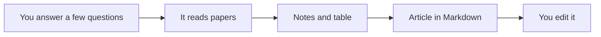

# Life-science literature review helper

This folder teaches a chat assistant how to write a **literature review** with you. You do not need to know how to code.

It is **non-commercial**: free for your thesis, papers, and teaching. You may not sell it. See [LICENSE](LICENSE).

## Does it work?

Yes — here is a real review this workflow produced (open it and skim the introduction):

**[Nanocarriers, liposomes, and silver–antibiotic papers (sample article)](review/runs/2026-09-19-nanocarriers/article.md)**

Next to it: a [comparison table](review/runs/2026-09-19-nanocarriers/table/literature-table.md) and a [check that numbers match the papers](review/runs/2026-09-19-nanocarriers/double-check.md).

That article is a **draft** for you to judge the level. Do not copy it into your own paper as if it were yours.

## What you get

A text file called `article.md` (Markdown: a simple text format you can open here, or paste into Word).

If you ask, you can also get Word or PDF in Times New Roman, justified.

## How to use it (no coding)

You need a paid or school chat account: **[Cursor](https://cursor.com)** (easiest), **ChatGPT**, or **Claude**.

### In Cursor (recommended)

1. Open this project: on GitHub click **Code → Open with Cursor**, or download the ZIP and use **File → Open Folder**.
2. Open **Chat**. You never have to open the code files.
3. Type: `Review my papers` or `I want a literature review on [your topic]`.
4. Answer a few questions (see below). Say yes when the plan sounds right.
5. Wait. The article appears in `review/` as `article.md`.

### In ChatGPT or Claude

1. On GitHub: **Code → Download ZIP**.
2. Make a Project and upload `AGENTS.md` (the instruction file) plus your PDFs if you have them.
3. Type: `Follow AGENTS.md. I work in [your field]. I want a literature review.`

## What it will ask you first

It should **not** start writing the article immediately. It should ask:

- your **research area**
- **why** you need the review (thesis, grant, paper introduction, reading)
- whether you **already have papers** (put PDFs in the `papers/` folder, or paste titles in the chat)
- if you have none, whether it may **search free open-access papers** on the web (it will not break paywalls)
- **years** and how picky to be about **journals** (you can say “last 6 years, peer-reviewed journals”)

Then it reads the papers, makes notes, builds a table, writes the article, and checks itself.



## What it will not do

- Invent citations
- Open papers that are behind a paywall
- Replace your scientific judgment

## License

[Non-commercial](LICENSE) — use freely for research and teaching; do not sell.

---

Repo: [github.com/hvianagil-alt/literature-ai-workflow](https://github.com/hvianagil-alt/literature-ai-workflow)

```bash
git clone https://github.com/hvianagil-alt/literature-ai-workflow.git
cd literature-ai-workflow
```
